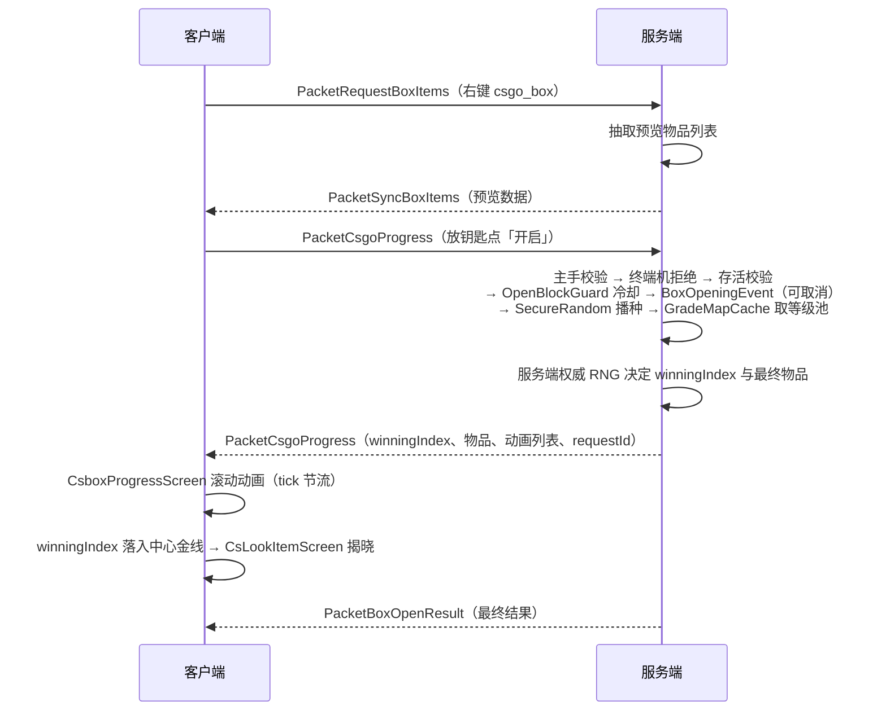

<!-- regenerated: 2026-09-10 for 2.0.0 (six-platform release) -->
# CS2-Box 架构

> 六平台 CS:GO 风格开箱模组的模块拓扑、核心抽象、数据流、渲染管线与工程门禁。
> 当前版本 **`2.0.0`**（六平台同步正式发布）。

## 1. 项目概览

CS2-Box 是用 Java 17 / 21 / 25 编写的 NeoForge + Forge 模组，把 CS:GO 的开箱机制复刻进 Minecraft。
所有与 MC 无关的纯业务逻辑都在 `common/` 中，六个平台模块只承担入口注册、Screen 实现、网络接线、
能力注册与渲染适配等版本敏感工作。

**关键事实**：

- 模组 ID：`csgobox`；当前版本 `2.0.0`；License MIT
- **六平台矩阵**：NeoForge `1.21.1` / `26.1.2` / `26.2` + Forge `1.20.1` / `26.1.2` / `26.2`，共享同一 `mod_version`
- Java toolchain：`v1_21_1` 用 21；`v26_1_2` / `v26_2` / `forge_26_1_2` / `forge_26_2` 用 25 + `--enable-preview`；
  `forge_1_20_1` 用 17
- 共享资源：`common/src/main/resources/` 由六个平台通过
  `srcDir project(':common').file('src/main/resources')` 引入（平台侧 `duplicatesStrategy = EXCLUDE`，
  平台 srcDir 在前、同名文件平台副本优先）
- 依赖方向约束：**`common/` 不得直接 `import net.minecraft.*`、`net.neoforged.*` 或 `net.minecraftforge.*`**
  （由 `:common:checkCommonArchitecture` Gradle task 自动拦截，见 §12）
- **每次 Gradle 调用只能构建一个 MC 版本**（NeoGradle userdev 会在 root project 注册同名 IDEA 扩展，
  多版本并行加载不可靠），用 `-Pactive_versions=<v>` 选择

## 2. 模块拓扑

```
+----------------------+  +----------------------+  +----------------------+
|      v1_21_1/        |  |      v26_1_2/       |  |       v26_2/         |
|  NeoForge 21.1.248   |  |  NeoForge 26.1.2.95  |  |  NeoForge 26.2.0.59  |
|  Java 21             |  |  Java 25 + preview   |  |  Java 25 + preview   |
|  era: legacy         |  |  era: decoupled      |  |  era: decoupled      |
+----------------------+  +----------------------+  +----------------------+
+----------------------+  +----------------------+  +----------------------+
|   forge_26_1_2/      |  |    forge_26_2/       |  |    forge_1_20_1/     |
|  Forge 26.1.2-64.1.0 |  |  Forge 26.2-65.1.1   |  |  Forge 1.20.1-47.4.22|
|  Java 25 + preview   |  |  Java 25 + preview   |  |  Java 17             |
|  era: decoupled      |  |  era: decoupled      |  |  era: legacy         |
+----------------------+  +----------------------+  +----------------------+
              ↑                      ↑                      ↑
              └──────── common/ (纯 Java 业务逻辑 + 共享资源) ────────┘
```

依赖关系：六个平台 → `common`；`common` 不依赖任何平台。`active_versions` 决定单次构建哪个平台。

### 2.1 平台规模（2026-09-10 实测）

| 模块 | main Java 文件 | main LOC | 平台测试 | 备注 |
|---|---:|---:|---:|---|
| `common/` | 29 | 3884 | 25 个测试类 / 210 用例 | 纯 JDK，无 MC 依赖 |
| `v1_21_1/` | 100 | 17831 | `PlatformSmokeTest` | 含 TACZ compat + JEI/REI/EMI + Jade/WTHIT/TOP |
| `v26_1_2/` | 95 | 15532 | `PlatformSmokeTest` | **跨平台改动基准模块**；JEI/REI + Jade/WTHIT/TOP |
| `v26_2/` | 96 | 15508 | — | decoupled API 适配；同 v26_1_2 查查看器套件 |
| `forge_26_1_2/` | 83 | 14608 | `PlatformSmokeTest` | Forge 侧基准；WTHIT（唯一信息显示） |
| `forge_26_2/` | 84 | 14634 | `PlatformSmokeTest` | 以 `forge_26_1_2` 为基准迁移；WTHIT |
| `forge_1_20_1/` | 102 | 17223 | `PlatformSmokeTest` | 三大重写区；TACZ compat + JEI/REI/EMI + Jade/WTHIT/TOP |

### 2.2 文件存在性差异矩阵

| 文件 | v1_21_1 | v26_1_2 | v26_2 | forge_26_1_2 | forge_26_2 | forge_1_20_1 |
|------|:-------:|:-------:|:-----:|:------------:|:----------:|:------------:|
| `Networking`（Forge `SimpleChannel`） | — | — | — | ✅ | ✅ | ✅ |
| TACZ compat（2 文件 + 检视屏） | ✅ | — | — | — | — | ✅ |
| `HudVisibility`（26.2 无 `Options.hideGui`） | — | — | ✅ | — | ✅ | — |
| JEI（4 文件） | ✅ | ✅ | ✅ | ❌ | ❌ | ✅ |
| REI（3 文件） | ✅ | ✅ | ✅ | ❌ | ❌ | ✅ |
| EMI（4 文件） | ✅ | — | — | — | — | ✅ |
| Jade（3 文件） | ✅ | ✅ | ✅ | ❌ | ❌ | ✅ |
| WTHIT（3 文件 + `waila_plugins.json`） | ✅ | ✅ | ✅ | ✅ | ✅ | ✅ |
| TOP（3 文件） | ✅ | ✅ | ✅ | ❌ | ❌ | ✅ |
| `gui/pip/`（PIP 3D 渲染器） | — | ✅ | ✅ | ✅ | ✅ | — |
| `PacketSyncBoxDefinitions` | ✅ | ✅ | ✅ | ✅ | ✅ | ✅ |

> JEI / REI 在 `forge_26_1_2` / `forge_26_2` 缺失是**已知待办**（Modrinth 无 JEI 26.x Forge 构建），非缺陷。

## 3. 核心抽象（common/）

`common/` 共 29 个主类，按职责分为 5 个包。

### 3.1 箱子数据模型（`common/box/`）

- **`BoxDefinition`**（平台 record）— 箱子定义本体。Codec / StreamCodec 依赖 MC 序列化设施，故留在平台；
  静态常量与 `gradeLevel` 纯函数已下沉 `BoxGrades`
- **`BoxGrades`** — 5 档等级名 ↔ 等级号映射、默认权重 `{625,125,25,6,4}`、drop rate 夹取、
  各 schema 上限常量（`MAX_GRADES` / `MAX_DROP_ENTITIES` / `MAX_ENTITY_DROP_RATES`）
- **`BoxRegistryStore<K,V>`** — 泛型注册表容器；`register` / `remove` 无条件触发变更回调，`clear` 触发清空回调。
  平台 `BoxRegistry` 是只提供键型（`ResourceLocation` / `Identifier`）与 `GradeMapCache` 失效回调的薄壳
- **`BoxStripGenerator`** — 泛型开箱滚动条生成（`Strip<T>` = items / grades / winningIndex），
  经 `GradeMap.isValid` 定位中奖位；平台传 `ItemStack.EMPTY` 作空值
- **`BoxJsonSchemaValidator`** — JSON schema 校验（common 单测主力，34 用例），产出 `SchemaIssue` 列表
- **`BoxDefaults`** — 教程内嵌资源复制（`writeTutorialIfMissing` / `refreshTutorials`）+ 遗留 `terminal.json`
  一次性 `type` 迁移。教程 markdown **随包内置**（`assets/csgobox/tutorials/tutorial.md` / `tutorial_zh_cn.md`，
  固定资源名；落盘文件名带版本号），首次启动复制到 `config/csbox/`，离线可用、**无网络依赖**。
  **当前版本教程全部就位后**才按 `^_tutorial_v.*\.md$` 白名单删除旧版教程；复制失败/无 jar 清单版本
  （dev/IDE）时**跳过复制与删除**（v2.0.1 修复：杜绝 `_tutorial_vunknown.md` 与误删已有教程）
- **`BoxFileWatcher`** — `config/csbox/` 文件监听（300ms 防抖热重载），纯 JDK `WatchService`
- **（v2.0.1 已移除）`TutorialFetcher` / `TutorialSources`** — 原教程联网下载与镜像源机制，换用包内嵌
  后彻底删除，运行时零网络外联
- **`BoxOdds` / `NetworkLimits` / `BoxReloadCallback`** — 概率展示模型 / 包体上限常量 / 重载回调契约
- **`BoxJsonLoader`**（平台）— 加载 `config/csbox/*.json`：首次启动保证目录存在、把包内教程复制到本机
  （`downloadTutorialsAsync()` 供服务端 `loadAll()` 与客户端 `onClientSetup` 共用，专用服务器玩家
  本机也落一份教程）、对遗留 `terminal.json` 做一次性 type 迁移；在 `ServerStartingEvent` 触发 `loadAll()`。
  **2.0.0 起终端机不再生成默认配置**——出厂即空箱，与普通箱一样由玩家自建 JSON。
  **v2.0.1**：文件名合法性校验、`enabled`/`requires` 门控、空档位 warning、`validateFile`
  干跑（`/csbox validate`）、解析全部新字段；损坏文件**保留原位**（`/csbox info error` 持续报告）
- **`GradeGroup` / `RandomItem`**（平台）— 5 档物品 + 加权随机选择（用 `long` 累加总权重避免溢出）。
  **v2.0.1**：`GradeGroup` 新增平行 `itemWeights` 列表（档内物品权重，默认全 1 = 均匀；0 = 禁用条目）

**物品 schema**（v2.0.1 扩展）：`{ "id" | "tag": "#..." | "loot_table": "...", "count": 1 | [min,max],
"weight": N, "enchant": true | {id,level}, "components": {...} }`。`#tag` 加载时展开为成员物品；
`loot_table` 开箱时服务端掷表（预览显示桶占位 + `item_spec` 标记）；`count` 区间开箱时随机。
未知物品 id 区分「目标模组未装」vs「id 拼写错」（`CsgoBox.isModLoaded`）。旧版 `tag` 字符串仍可加载。
完整 schema 文档见 `docs/CONFIGURATION.md` 与 `docs/box-schema/box.schema.json`。

### 3.2 开箱服务端逻辑（`common/logic/`）

- **`OpenBlockGuard`** — 服务端权威开箱冷却（10 tick）：`isBlocked(UUID, now)` 惰性过期移除、
  `block(UUID, now, cooldown)` 后写覆盖、`tick(now)` 周期清理。**六个平台**的 packet 与
  `ModEvents#serverTick` 共用。过期移除用条件式 `remove(key, value)`：若期间有并发 `block` 写入新期限，
  不会误删（规避 ABA 竞态导致冷却失效）
- **`GradeMap` / `GradeMapCache`** — 每箱的不可变等级池 + 按 box id 缓存（reload 时失效）。
  `pickRandom` 返回副本，调用方可自由修改。普通开箱与批量开箱共用同一份缓存。
  **v2.0.1**：支持档内加权（`fromWeighted` / `Weighted<T>` / `empty()`），`pickRandom` 按权重选取
- **`BoxConstraintTracker`**（v2.0.1）— 开箱约束内存追踪（每玩家每箱开箱计数 / 最后开箱 tick，
  驱动 `max_per_player` 与 `cooldown_seconds`；重启清零，文档注明）
- **`TerminalStockManager`**（v2.0.1，`common/terminal/`）— 终端全局库存 + 补货定时器（内存态）
- **`AnimationStrip`** — 滚动条动画的纯数学部分（tick → 位置插值）
- **`OddsCalculator`** — 开箱概率计算（JEI / REI 展示与服务端同口径）

### 3.3 配置（`common/config/`）

- **`CsboxConfigDefaults`** — **六个平台 `CsboxConfig` 默认值与取值范围的唯一来源**；
  枚举默认以常量名字符串存储，平台侧 `valueOf` 解析
- **`CsboxConfig`**（平台）— NeoForge `ModConfigSpec` / Forge `ForgeConfigSpec`，
  **2.0.0 起由 17 字段收窄为 7 个服务端 / 服主向字段**，2 个 TOML 分组：

  | 分组 | 字段 | 说明 |
  |---|---|---|
  | `[general]` | `globalDropRatePercent` | 全局掉落率百分比（默认 100；0 = 关闭，无上限） |
  | `[advanced]` | `loadDefaultBoxes` | 启动时自动加载 `config/csbox/*.json` |
  | | `enableAchievements` | 成就系统开关（关闭时统计仍累加） |
  | | `enableHotReload` | 文件热重载（300ms 防抖） |
  | | `bulkOpenCount` | 单次批量开箱上限（0 = 无上限，服务端权威） |
  | | `jsonErrorAudience` | JSON 加载错误可见范围：`OP_ONLY`（默认）/ `EVERYONE` |
  | | `damageItemByWear` | 抽出的带耐久物品按磨损百分比扣耐久 |

- 注册为 `ModConfig.Type.COMMON`，TOML 路径 `config/csgobox.toml`
- **`CONFIG` 是 `public static final`**，在 `static {}` 块中经
  `ModConfigSpec.Builder().configure(CsboxConfig::new)` 初始化。**不要写 `null` 守卫**——
  该字段永不为 null（用 `init()` 延迟填充是 v1.0.5 已修的历史 bug）
- **存储与 GUI 分离**：`ModConfigSpec`/`ForgeConfigSpec` TOML 是唯一配置存储；Cloth Config（可选客户端模组）通过各平台 `config/CsboxClothConfigScreen.java` 提供 GUI，读/写同一 `ConfigValue`

### 3.4 物品（平台 `item/`）

- **`ItemCsgoBox`** — 普通宝箱，携带 `box_id` 组件指向 `BoxDefinition`
- **`ItemCsgoKey`** — 钥匙，5 档（`csgo_key0`~`csgo_key3` + `csgo_key_copper` 铜钥匙）
- **`ItemTerminal`** — 终端机，继承 `ItemCsgoBox`，覆写 `openScreen` 打开终端谈判屏
- **`ModItems`** — 集中注册 8 个基础物品：`csgo_box`、`csgo_key0`~`csgo_key3`、
  `csgo_key_copper`、`armory_point`、`terminal`，外加 5 个**随模组发布的默认箱子**固定物品
  （`ammo_crate` / `attachment_crate` / `gun_crate` / `normal_crate` / `tacz_terminal`，
  经私有 `fixedBoxItem(...)` 注册，默认实例自带 `box_id`）
- **物品注册表是编译期常量（v2.0.1 联机修复）**：注册**不再**扫描 `config/csbox/`。物品注册表
  是同步且启动期冻结的，曾因"每个文件名注册一个物品"导致两侧配置不同（或 `requires` 模组只装在
  一侧）即注册表分叉，联机被以「Failed to synchronize registry data」拒绝。自建箱子统一使用通用
  物品 `csgo_box` / `terminal`，身份走 `csgobox:box_id` 标签，界面类型由**箱子定义**分派
  （`ItemCsgoBox#openScreen` 读 `BoxDefinition#isTerminal`），发放走
  `/csbox give <玩家> <箱子> [数量]`（`ModItems#itemForBox` 负责选物品）。
  新增"随模组发布"的箱子 = 在 `ModItems` 里加一个 `fixedBoxItem` 常量，**不要**恢复动态注册。
- 钥匙梯度：铁（key0）→ 金（key1）→ 钻石（key2）→ 下界合金（key3，**仅**锻造台
  `smithing_transform` 升级 key2 获得）
- **钥匙/箱子扣减范围（设计决策）**：开箱（单开与批量）时服务端 `tryConsumeKeys` / `tryConsumeBoxes`
  扫描**整个原版 `PlayerInventory`**——主背包 36 格（含快捷栏）+ 护甲 4 格 + 副手 1 格，
  客户端 `hasKeyAnywhere` 镜像同样覆盖；**明确不支持模组扩展槽位（Curios / Trinkets 等）**，
  钥匙放在任何原版栏位均可被扣到（六平台行为一致）。

### 3.5 终端机模型（`common/terminal/`）

- **`NegotiationModel`**（576 行，common 最大的类）— 谈判状态机：轮次 / 状态 / 聊天历史 /
  倒计时 / 报价。`COUNT_INITIAL_MS` 定义默认 3 小时超时（单点常量）
- **`TerminalAnims` / `TerminalPalette`** — 终端 UI 的动画参数与配色 token
- **`WearBands` / `WearPenalty`** — 随机磨损档位；**无耐久条物品**按磨损百分比加价
  （`surcharge(basePrice, wear)` = `ceil(基础价 × 20% × 磨损)`，满磨损 +20%，向上取整）

### 3.6 平台薄壳与适配

common 无 `platform/` 接口层（2026-08 重构中移除），平台模块直接承载注册、网络、GUI 等版本敏感工作。

**保留在平台、不下沉**（与 MC 强耦合）：packet record 本体与 StreamCodec、`tryConsumeKeys` /
`tryConsumeBoxes`（inventory / EquipmentSlot / BuiltInRegistries）、`CsboxPlayerData`、
`OpenedBoxTrigger` / `ModLoadedTrigger`、`ModSounds`、`TerminalSession*` / `TerminalStateStore`、
`LoadError`（依赖 `Component`）、GUI / 渲染层。

## 4. 开箱数据流



**核心安全属性**：客户端在整条链路中**只渲染动画**，不参与任何随机决策。`requestId` 仅用于匹配
客户端动画结果，服务端从不采信。扣减（钥匙 / 箱子）与 RNG 全部在服务端 packet handler 中完成。

**批量开箱**：`PacketCsgoBulkProgress` 走异步线程池 `BULK_COMPUTE_POOL`（2 daemon 线程）预计算，
回主线程 finalize 并扣减；`bulkOpenCount` 上限由服务端权威截断，总览屏只做估算显示。

## 5. GUI 渲染管线

### 5.1 两个 era

平台的渲染 API 分属两个 era（各平台 `utils/AnimRenderOps.java` 头部有 `// era:` 标注）：

| 维度 | era: legacy（`v1_21_1` / `forge_1_20_1`） | era: decoupled（`v26_1_2` / `v26_2` / `forge_26_1_2` / `forge_26_2`） |
|---|---|---|
| 入口方法 | `Screen.render(GuiGraphics, ...)` | `Screen.extractRenderState(GuiGraphicsExtractor, ...)` |
| 矩阵抽象 | `PoseStack` | `Matrix3x2f` instance API（`guiGraphics.pose()`） |
| 渲染管道 | 静态 `RenderSystem` 调用 | decoupled rendering 管线（`RenderPipelines.GUI_TEXTURED` 等） |
| 3D 物品预览 | `BakedModel` 渲染管线 | 自定义 `PictureInPictureRenderState` + `Icon3DRenderer`（PIP 3D 路径） |
| 2D 网格物品 | 直接 blit | `guiGraphics.item(...)` 2D 渲染（deferred item pipeline） |
| Blit 签名 | 9-arg overload | `guiGraphics.blit(RenderPipeline, Identifier, ...)` 新签名 |
| 按钮色系 | 硬编码颜色 | `ButtonPalette.OPEN` / `ButtonPalette.DANGER` token（hover-aware） |
| 文本限宽 | 裸 `Font.width` | `RenderFontTool.drawStringClamped` + 省略号 |
| 渲染分层 | 单 stratum | `guiGraphics.nextStratum()` 分层 |

> Forge `forge_1_20_1` 的 `RenderSystem.getModelViewStack()` 返回 `PoseStack`（用
> `pushPose` + `mulPoseMatrix`），与 26.x 的 `Matrix4fStack` 方案不同。
> Forge 26.x 的 PIP 保持 **Forge 欧拉角方案**（`event.register(new Icon3DRenderer())` +
> `getRenderState().addPicturesInPictureState`），与 NeoForge 26.2 的 Quat / Supplier 方案不同。

### 5.2 `AnimRenderOps` 渲染门面

**每个平台唯一一份** `utils/AnimRenderOps.java`，是动画渲染的**唯一适配点**。6 个 Screen +
3 个渲染助手全部经它调用渲染原语，**零原始 draw 调用残留**。

13 个公开 op：

| 类别 | op |
|---|---|
| 纹理 | `blitTextured`（3 个重载：基础 / 带纹理尺寸 / 带 UV 区域） |
| 纯色 | `fill` / `fillGradient` |
| 裁剪 | `scissor` / `scissorDisable` |
| 状态 | `setBlendNormal` / `flush` |
| 背景 | `renderBlurredBackground` |
| 物品 | `renderItem2D` / `renderItem3D` / `supports3D` |

> `gunModelCenter` 是 `v1_21_1` 独有的 TACZ op（依赖 `compileOnly` 的 TACZ），
> 漂移检查脚本对它单独豁免。
>
> **新增原语必须三平台同步补**（`v1_21_1` / `v26_1_2` / `v26_2`），否则
> `scripts/check-animops-drift.sh` 失败——该脚本以 `v1_21_1` 为签名基准，CI 已接线。

### 5.3 Screen 清单（平台 `gui/`）

`CsboxScreen`（开箱主界面）、`CsboxProgressScreen`（滚动动画）、`CsLookItemScreen`（揭晓）、
`CsboxBulkOverviewScreen`（批量总览）、`CsboxBulkResultScreen`（批量流水揭晓）、
`TerminalScreen`（终端谈判）、`TerminalBootScreen`（终端开机动画）、`ArmoryRecyclerScreen`（拆解台），
以及 `InspectMenu`（右键检视菜单）、`UiBackdrop`（背景）、`BoxScreenOpener`（屏打开分发）。

`v1_21_1` / `forge_1_20_1` 另有 `FirstPersonInspectScreen`（TACZ 枪械第一人称检视，无 TACZ 时静默降级）。

### 5.4 平台独有工具类

- `gui/pip/Icon3DRenderer` + `Icon3DRenderState`（decoupled era）— PIP 3D 物品渲染
- `utils/ButtonPalette` — 按钮调色板 token + `drawButton(...)` + `isInside(...)`
- `utils/RenderFontTool` — `drawString` / `drawStringClamped`（二分截断 + `…` 后缀）
- `utils/IconListTools` — 2D 物品网格（26.x 起有 per-item bounding box 居中）
- `utils/GuiItemMove` — 3D 拖拽预览（`renderRotAngleX/Y` 纯数学保留，渲染委托 `AnimRenderOps`）
- `utils/HudVisibility`（`v26_2` / `forge_26_2`）— 26.2 移除了 `Options.hideGui`，
  改用 `Minecraft.gui.hud.toggle()` / `isHidden()` 包装，开箱动画屏自动隐藏 HUD
- common `utils/`：`ColorTools` / `OverlayColor`（三档 token：surface / panel / divider）/
  `GuiRegion`（容器化布局）/ `Easing` / `Quat` / `ItemDrag3D` / `EntityChineseMap`

## 6. 网络包

**14 个自定义数据包**。NeoForge 三平台用 `CustomPacketPayload`（`RegisterPayloadHandlersEvent`
统一注册）；Forge 三平台用 `SimpleChannel`（`forge_1_20_1` 走 `FriendlyByteBuf` 手动序列化，
26.x Forge 走 `CustomPayloadEvent` + `StreamCodec`），故 Forge 侧多一个 `Networking.java` 接线类。

| 包 | 方向 | 内容 |
|---|---|---|
| `PacketCsgoProgress` | C → S / S → C | 开箱请求 + 服务端权威 RNG 结果（winningIndex、items、grades、requestId） |
| `PacketBoxOpenResult` | S → C | 最终开箱结果（驱动 `CsLookItemScreen`） |
| `PacketRequestBoxItems` | C → S | 客户端拉取预览请求 |
| `PacketSyncBoxItems` | S → C | 预览数据（右键箱子时拉取） |
| `PacketValidation` | S → C | 请求校验（防过期响应匹配） |
| `PacketCsgoBulkProgress` | C → S | 批量开箱请求（`bulkOpenCount` 上限服务端权威截断） |
| `PacketBoxBulkResult` | S → C | 批量开箱 boxes 2..K 的简洁结果（分块聚合） |
| `PacketSyncBoxDefinitions` | S → C | **盒定义全量同步**（入服 / `/csbox reload` / 热重载后广播），客户端 `clear + register` 覆盖 |
| `PacketTerminalOpen` | C → S | 开屏取锁（主手为权威） |
| `PacketTerminalState` | S → C | 终端全量快照（轮次 / 状态 / 历史 / 倒计时 / 5 轮报价 + 物品 / 槽位物品） |
| `PacketTerminalReject` | C → S | 拒绝报价，服务端 `rejectForced` 无条件推进 |
| `PacketTerminalBuy` | C → S | 购买（按服务端当轮实际物品逐字段校验 + 扣军械库点数） |
| `PacketTerminalBuyResult` | S → C | 购买结果展示 |
| `PacketTerminalClose` | C → S | 关屏钉住轮次 / 状态 / 倒计时（倒计时服务端权威，不上报） |

每个包都有 `Codec`（持久化）与 `StreamCodec`（网络流）。开箱防双击冷却由 common `OpenBlockGuard`
统一提供（10 tick 窗口），packet record 本体与 StreamCodec 保留在平台。

**`PacketSyncBoxDefinitions` 的意义**：专用服务器下，客户端的箱子定义内容（权重 / 价格 / 物品清单 /
JEI 概率）**始终以服务端为准**，与本地 JSON 是否一致无关；v2.0.1 起**物品注册**同样不再读取本地 JSON
（编译期常量），因此联机只要求**模组版本一致**。

## 7. 事件订阅

`event/` 包 8 个类：

- **`ClickEvent`** — `@EventBusSubscriber(value = Dist.CLIENT)`，处理右键开箱、Screen 按钮点击
- **`ModEvents`** — `LivingDeathEvent`（生物掉落 csgo_box 投骰）、`ServerStartingEvent`
  （触发 `BoxJsonLoader.loadAll`）、`serverTick`（驱动 `OpenBlockGuard.tick` 与终端会话 `tickSessions`）
- **`LoadErrorAnnouncer`** — 按 `jsonErrorAudience` 向玩家播报 JSON 加载错误
- **`ScreenBlurBoost`** — 开屏模糊增强（Blur 模组软适配）

### 7.1 对外扩展事件（KubeJS / Java 兼容）

| 事件 | 可取消 | 用途 |
|---|:---:|---|
| `BoxOpeningEvent` | ✅ | 开箱**前置**校验——任何 roll 与物品消耗之前，可整体否决 |
| `BoxOpenedEvent` | — | 开箱**后**通知（post-event） |
| `TerminalBuyEvent` | — | 终端成交，用于经济记账 |
| `ArmoryRecycleEvent` | ✅ | 拆解，可做黑名单 |

用法与示例见 [`KUBEJS-EVENTS.md`](./KUBEJS-EVENTS.md)。

## 8. 成就与统计

通过 Minecraft 原生 `CriteriaTriggers` + `Stats.CUSTOM` 持久化，**无需新增 Capability**，存档迁移无影响。

4 个触发器：`OpenedBoxTrigger`（`csgobox:opened_box`）、`ModLoadedTrigger`、
`TerminalDealTrigger`、`TerminalBrokeTrigger`。

2 个自定义统计：`csgobox:opened_boxes`、`csgobox:terminal_buys`。

`common/src/main/resources/data/csgobox/advancement/` 下 13 个成就节点，挂在 `root.json` 之下，
涵盖：首次开箱（`first_box`）、累计开箱（`collector_10/50/100`、隐藏挑战 `shopper`）、
稀有度里程碑（`grade_mil_spec` / `grade_restricted` / `grade_classified`）、
终端线（`terminal_deal` / `terminal_broke` / `terminal_mogul`）、拆解（`recycler_first`）。

> 关闭 `enableAchievements` 时统计仍累加（保留进度），重新开启后恢复触发。

## 9. 终端机谈判子系统

终端机（`ItemTerminal` 物品）走**独立的服务端权威谈判会话**，与普通宝箱的 RNG 开箱流水线完全隔离。
完整演进与边界见 [`REPORT-TERMINAL-DECOUPLING.md`](./archive/REPORT-TERMINAL-DECOUPLING.md)。

### 9.1 会话锁

- **`TerminalSessionManager`** — 静态 `ConcurrentHashMap`，键 `玩家UUID:终端机UID`（会话绑定到终端机物品的 `terminal_uid`，**不是**绑定箱子类型 ID），持有每个玩家的谈判会话；
  `TerminalSession` 内含 common `NegotiationModel`（轮次 / 状态 / 聊天历史 / 倒计时 / 报价）
  + 5 轮 `TerminalRoundData` + 区域 10 槽位物品
- 生命周期：`PacketTerminalOpen` 取锁（新会话采样 5 轮报价 / 已有会话恢复快照）；
  `PacketTerminalReject` / `PacketTerminalBuy` / `PacketTerminalClose` 走服务端强制推进；
  `isFinished()`（`CLOSED` 成交 / `FAILED` 第 5 轮拒绝或超时）后释放锁，下次开启为全新谈判
- 未满 5 轮拒绝 / 未成交前重开终端机，对话、报价、物品与上次离开**完全一致**
- 终态即「消耗」：成交（`CLOSED`）与谈崩（`FAILED`）都会**销毁终端机物品本身**

### 9.2 计时与自毁

- 六平台 `ModEvents.serverTick` 每 1 Hz 驱动 `tickSessions`，按**世界时钟**
  （`player.level().getGameTime() * 50L`）推进倒计时；世界暂停 / 服务端停机不计时，重启后精确续算
- 默认超时 3 小时（`NegotiationModel.COUNT_INITIAL_MS`，common 单点）
- 超时未成交与 5 轮拒绝同等对待：`FAILED` + 系统消息「交易超时，军火商已离开。」并释放锁。
  超时同时**销毁终端机物品**——服务端按 `terminal_uid`（`DataComponentType<String>`，首开时写入物品）
  在背包（主栏 + 护甲 + 副手）精确销毁；离线 / 在容器时 uid 进「已销毁 uid 集合」，
  下次持有者打开当场销毁
- 5 轮全拒（谈崩）：主手终端机当场 `setCount(0)` + `removeByUid` 释放锁 + 消息「谈判破裂，军火商已离开。」

### 9.3 持久化与转手

- **`TerminalStateStore`** — 会话 + 已销毁 uid 集合落盘 `<world>/csgobox/terminal_state.bin`
  （魔数 + `VERSION=3`），随服务端启停 bind / unbind，任何变更 `markDirty()` 即时写盘
- 物主名字盖在物品组件 `terminal_owner`（创建会话时盖章）
- **转手锁死**：终端机转手后若原会话仍被原主活跃持有（未过期未成交），新持有者打开进入锁死态 `FAILED`，
  军火商发「去问问 xx 吧。」（`csgobox.terminal.sys.locked`，优先用在线玩家名处理改名）
- 服务端买 / 拒按**发送者会话键**校验，无法越权交易
- 购买成功（服务端当轮物品校验通过）后：授予物品 + 销毁终端机物品与 uid + 释放会话锁

### 9.4 服务端权威细节

- `PacketTerminalBuy` 按服务端**当轮实际物品**逐字段校验，并用 `WearPenalty` 对无耐久条物品按磨损
  **百分比**加价（`ceil(基础价 × 20% × 磨损值)`，与客户端 `TerminalOfferItems` 同公式；
  有耐久条物品走 `damageItemByWear` 扣耐久路径，不加价）
- `PacketTerminalReject` 推进下一轮时 `roundStartMs` 设为拒绝时刻 `+ REJECT_BUSY_MS(450ms)`，
  使服务端买 / 拒门限（1550ms）与客户端动画（450ms busy + 1100ms typing）对齐——
  堵住改包客户端提前购买下一轮报价的口子
- `TerminalScreen` 在 `init()`（re-show 每次都会调用）恢复单例、重置 `closeSynced` / `stateReceived`、
  刷新 requestId 并重发 Open 包重挂绑定——修复「检视子屏返回后终端屏失联」

## 10. 经济闭环

开箱 → 武库点数 → 拆解 / 终端购买 → 再开箱，构成完整循环。

- **军火商职业村民**（`villager/ModVillagers`）— 防解雇 / 防消失加固；
  `data/csgobox/trade_set/` + `villager_trade/` 定义 5 级交易表。
  **动态定价**：价格锚定 `_prices.json`（common `VillagerPricing`，
  `_villager_prices.json` 调参）——1.20.1 / 1.21.1 走 `VillagerTrades` 代码注册现场报价；
  26.x 保持 datapack 注册，价格字段引用自定义 loot `NumberProvider`
  `csgobox:arms_dealer_price`（`loot_number_provider_type`），收购端用
  `minecraft:set_count` 动态改写点数，村民刷新交易时按 `LootContext` 随机源重采样；
  `enabled=false` 回退 JSON 内静态 `fallback`（详见 `docs/CONFIGURATION.md` 3.4）
- **武库商小屋**（`data/csgobox/structure/` + `worldgen/`）— 野外据点（`structure_set` + 商店宝箱
  `loot_table/chests/arms_dealer_hut.json`）+ **接入原版 5 群系村庄道路自然生成**
  （`data/minecraft/worldgen/template_pool/village/*/houses.json`）
- **武库拆解台**（`block/ArmoryRecyclerBlock` + `menu/ArmoryRecyclerMenu`）— 把开出的物品换成军械库点数
- **军械库点数**（`armory_point` 物品）— 终端机谈判的通货

## 11. 资源分层

```
common/src/main/resources/          ← 跨版本共享（六平台经 srcDir 引入）
  ├── assets/csgobox/lang/           (en_us / zh_cn)
  ├── assets/csgobox/models/         (block/ + item/)
  ├── assets/csgobox/textures/       (block/ entity/ gui/ item/ screens/)
  ├── assets/csgobox/sounds/         + sounds.json
  ├── assets/minecraft/shaders/      (fade_in_blur，模糊背景增强)
  └── data/csgobox/
      ├── advancement/               (13 个成就节点)
      ├── recipe/                    (单数 recipe！6 个配方)
      ├── loot_table/chests/         (武库商小屋宝箱)
      ├── structure/ + worldgen/     (武库商小屋)
      ├── tags/worldgen/biome/       (生成群系标签)
      └── trade_set/ + villager_trade/ (军火商交易表；26.x 动态价格经 csgobox:arms_dealer_price provider)

<平台>/src/main/resources/           ← 平台特化
  ├── META-INF/neoforge.mods.toml | mods.toml
  ├── pack.mcmeta
  └── assets/csgobox/items/          (物品定义：csgo_box / csgo_key0-3 /
                                      armory_point / armory_recycler / terminal)
```

> **资源路径必须用单数 `recipe`**——Minecraft `RecipeManager` 的
> `Registries.elementsDirPath(Registries.RECIPE)` 要求，写成 `recipes` 会静默不加载。
>
> 物品定义目录为 `items/`（1.21.4+ 的 `assets/<ns>/items/` 形态），六平台一致；
> 各平台另有自己的 `data/csgobox/advancement(s)/` 副本用于平台特有节点。

## 12. 依赖方向约束与工程门禁

### 12.1 CONSTRAINT-001

- **`common/` 不允许** `import net.minecraft.*` / `net.neoforged.*` / `net.minecraftforge.*`
- 所有版本敏感代码（GUI 渲染、能力注册、网络上下文、注册表访问）留在平台模块
- 平台模块不重复实现 common 业务逻辑
- 由 `:common:checkCommonArchitecture` Gradle task 自动化执行（挂载在 `compileJava` 依赖上，
  任何编译 / 测试都会触发，含 forge 模块把 common 源码编进自身 classpath 的场景）

### 12.2 平台模块镜像纪律

六个平台**不是纯拷贝**，各有 API 适配。**禁止用 `v26_1_2` 整文件覆盖 `v26_2` / `forge_*`**——
会破坏适配（历史教训）。正确姿势：

1. **先改基准模块**：新功能以 `v26_1_2` 为基准；Forge 侧以 `forge_26_1_2` 为基准
2. **新增无差异文件**用 `scripts/mirror.sh new <rel-path>`（目标已存在会警告跳过，
   `--force` 覆盖，`--dry-run` 预演）
3. **有适配差异的文件定点合入**，不得被脚本覆盖
4. 每平台 `compileJava` 验证；**改动涉及平台时用 `clean` 编译确认**（增量缓存可能造假象）

Forge 侧的机械移植脚本：`scripts/port-forge-2612.py`（`v26_1_2` → `forge_26_1_2`）、
`scripts/port-forge-262.py`（`forge_26_1_2` → `forge_26_2`）。入口 `CsgoBox.java`、`Networking`、
`ModItems`、`ModCapability`、packet handler、GUI / 渲染层、`AnimRenderOps` 等**走手工适配**。

### 12.3 门禁清单

| 门禁 | 脚本 / 任务 | 覆盖 |
|---|---|---|
| common 架构约束 | `:common:checkCommonArchitecture` | 六平台编译均触发 |
| common 单元测试 | `./gradlew :common:test` | 25 个测试类 / 210 用例（JUnit 5） |
| AnimRenderOps 漂移 | `scripts/check-animops-drift.sh` | `v1_21_1` / `v26_1_2` / `v26_2`，以 `v1_21_1` 为签名基准 |
| 版本四同步 | `scripts/check-version.sh` | `gradle.properties` + `mods.toml` + `CHANGELOG.md` + `README.md` |
| 平台冒烟测试 | `./gradlew :<module>:test` | `v26_1_2` / `v26_2` / `forge_26_1_2` / `forge_26_2` / `forge_1_20_1` |
| Forge 门禁 | `scripts/test-forge-2612.sh` / `test-forge-262.sh` | Forge 模块（7 项） |

CI（`.github/workflows/build.yml`）矩阵只覆盖 **3 个 NeoForge 平台**；Forge 三平台为手工 / 门禁脚本
产出（`forge_26_1_2` / `forge_26_2` 不参与镜像纪律与 AnimRenderOps 漂移门禁）。

代码审查标准见 [`CODE-REVIEW.md`](./CODE-REVIEW.md)；PR 模板由 CI `pr-checks.yml` 校验。

### 12.4 永久移除项

**`premium_supply_box` / `ItemPremiumBox` 已永久移除（2026-08-19）**——该「军火商高级箱」物品及其全部
痕迹（代码 / 资源 / 配置 / 文档）已彻底删除。**禁止以任何形式再次引入**（含复活历史条目）。
`forge_26_1_2` / `forge_26_2` 的 `PlatformSmokeTest` 含反向守卫
（`premiumBoxItemIsPermanentlyRemoved`）断言该字段永不回归。

## 13. 版本矩阵

| 组件 | v1_21_1 | v26_1_2 | v26_2 | forge_26_1_2 | forge_26_2 | forge_1_20_1 |
|---|---|---|---|---|---|---|
| Minecraft | 1.21.1 | 26.1.2 | 26.2 | 26.1.2 | 26.2 | 1.20.1 |
| 加载器 | NeoForge 21.1.248 | NeoForge 26.1.2.95 | NeoForge 26.2.0.59 | Forge 26.1.2-64.1.0 | Forge 26.2-65.1.1 | Forge 1.20.1-47.4.22 |
| NeoGradle / ForgeGradle | 7.1.38 | 7.1.38 | 7.1.38 | `[7.0.17,8)` 动态 | `[7.0.17,8)` 动态 | 7.0.31 固定 |
| Gradle | 9.5.1 | 9.5.1 | 9.5.1 | 9.5.1 | 9.5.1 | 9.5.1 |
| Java toolchain | 21 | 25 + preview | 25 + preview | 25 + preview | 25 + preview | 17 |
| `pack_format` | 34 | 80 | 81 | 80 | 81 | 15 |
| rendering era | legacy | decoupled | decoupled | decoupled | decoupled | legacy |
| 包名 | `...csgobox.v1_21_1.*` | `...csgobox.v26_1_2.*` | `...csgobox.v26_2.*` | `...csgobox.forge_26_1_2.*` | `...csgobox.forge_26_2.*` | `...csgobox.forge_1_20_1.*` |
| `mod_version` | `2.0.0` | `2.0.0` | `2.0.0` | `2.0.0` | `2.0.0` | `2.0.0` |
| CI 矩阵 | ✅ | ✅ | ✅ | — | — | — |

**jar 命名**：NeoForge `csgobox-<mc>-<mod_version>.jar`，Forge `csgobox-forge-<mc>-<mod_version>.jar`。

> **已归档（EOL）平台**：`v1_21_0` / `v1_21_3` / `v1_21_4` / `v1_21_5` / `v1_21_8` / `v1_21_10` /
> `v1_21_11` 于 2026-08-09 移出仓库，最后状态保留在 tag `eol-legacy-21x-1.0.6`；旧版本玩家仍可下载
> 既有发布产物。
