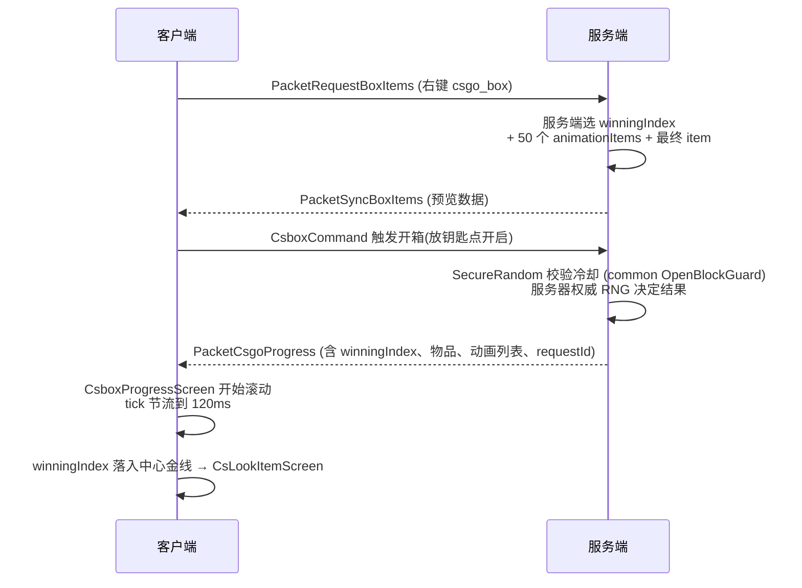

<!-- generated-by: gsd-doc-writer -->
# CS2-Box 架构

> 跨 v1_21_1 / v26_1_2 / v26_2 / forge_26_1_2 四平台的 CS:GO 风格开箱模组的模块拓扑、核心抽象、数据流与渲染管线。

## 1. 项目概览

CS2-Box 是用 Java 21 / 25 编写的 NeoForge/Forge 模组,把 CS:GO 的开箱机制复刻进 Minecraft。核心抽象与 MC 无关的纯业务逻辑都在 `common/` 中,四个平台模块(`v1_21_1/`、`v26_1_2/`、`v26_2/`、`forge_26_1_2/`)只承担入口注册、Screen 实现、网络接线、Attachment 注册等版本敏感工作。

**关键事实**:

- 模组 ID:`csgobox`,当前版本 `2.0.0-beta`（1.0.7/1.0.8 开发线合并发行）
- Java toolchain:`v1_21_1` 用 Java 21,`v26_1_2` 用 Java 25 + `--enable-preview`(NeoForm 重编译要求)
- 共享资源:`common/src/main/resources/` 由四个平台通过 `srcDir project(':common').file('src/main/resources')` 引入(平台侧 `duplicatesStrategy = EXCLUDE`,平台 srcDir 在前、同名文件平台副本优先)
- 依赖方向约束:**`common/` 不得直接 `import net.minecraft.*` 或 `import net.neoforged.*` / `net.minecraftforge.*`**(由 `:common:checkCommonArchitecture` Gradle task 自动拦截)

## 2. 模块拓扑

```
+----------------------+        +----------------------+        +----------------------+
|      v1_21_1/        |        |      v26_1_2/        |        |        common/       |
|----------------------|        |----------------------|        |----------------------|
| @Mod 入口 (v1.21.1)  |        | @Mod 入口 (v26.1.2)  |        | 平台薄壳 + 业务逻辑    |
| DeferredRegister     |        | DeferredRegister     |        | 共享业务逻辑          |
| AttachmentType       |  <-->  | AttachmentType       |  <-->  | BoxDefinition        |
| Screen 实现          |        | Screen (extractRender|        | BoxJsonLoader        |
| GuiGraphics 旧 API   |        | State API + PIP 3D) |        | RandomItem           |
| 网络接线             |        | 网络接线              |        | 数据包 Codec         |
| events 订阅          |        | events 订阅           |        | 共享资源(纹理/配方)  |
+----------------------+        +----------------------+        +----------------------+
         ↑                                ↑                                 ↑
         └───── shared: common/src/main/resources/ ←────────────────────────┘
```

依赖关系:`v1_21_1` / `v26_1_2` / `v26_2` / `forge_26_1_2` → `common`;`common` 不依赖任何平台模块。`active_versions` 决定单次构建哪个平台(每次 Gradle 调用只能构建一个 MC 版本)。

## 3. 核心抽象(common/)

### 3.1 箱子数据模型

- **`BoxDefinition`** — 平台 record（Codec/网络编解码依赖 MC），静态常量与 `gradeLevel` 纯函数已下沉 `BoxGrades`
- **`BoxGrades`** — 5 档等级名→等级号映射、默认权重 `{625,125,25,6,4}`、drop rate 夹取与各 schema 上限常量（2026-08 重构下沉）
- **`BoxRegistryStore<K,V>`** — 泛型注册表容器（register/remove 无条件触发变更回调、clear 触发清空回调）；平台 `BoxRegistry` 是提供键型（`ResourceLocation`/`Identifier`）与 `GradeMapCache` 失效回调的薄壳
- **`BoxStripGenerator`** — 泛型开箱滚动条生成（`Strip<T>` = items/grades/winningIndex，经 `GradeMap.isValid` 定位中奖位）；平台传 `ItemStack.EMPTY` 作空值
- **`BoxJsonLoader`**（平台） — 加载 `config/csbox/*.json`;首次启动保证目录存在、异步下载教程 md(`BoxDefaults`),并**自动生成 `terminal.json` 默认配置**(v2.0.0 恢复自动生成,用户文件不覆盖;普通箱仍由玩家自建 JSON);在 `ServerStartingEvent` 触发 `loadAll()`
- **`GradeGroup` / `RandomItem`** — 5 档物品 + 加权随机选择(long 类型总权重避免溢出)
- **物品 schema**:`{ "id": "...", "count": 1, "components": {...} }`(1.21+ components),旧版 `tag` 字符串仍可加载

### 3.1a 开箱服务端逻辑（common/logic/）

- **`OpenBlockGuard`** — 服务端权威开箱冷却（10 tick）：`isBlocked(UUID, now)` 惰性过期移除、`block(UUID, now, cooldown)` 后写覆盖、`tick(now)` 周期清理；四平台 packet 与 `ModEvents#serverTick` 共用（原平台 `PacketCsgoProgress.OPEN_BLOCKED_UNTIL_TICK` 逐字迁移，2026-08 重构下沉）
- **`CsboxConfigDefaults`**（common/config/） — 全部配置默认值与取值范围的唯一来源，四平台 `CsboxConfig` builder 引用（枚举默认以常量名字符串存储，平台侧 `valueOf` 解析）

### 3.2 配置

- **`CsboxConfig`**（平台） — NeoForge `ModConfigSpec`/Forge `ForgeConfigSpec`,17 个配置项,5 个 TOML 分组(general / advanced / sound / animation / ui，UI 组含 `backgroundStyle` 与 `blurRadius`)；默认值与范围统一引 common `CsboxConfigDefaults`
- 注册为 `ModConfig.Type.COMMON`,TOML 路径 `config/csgobox.toml`
- `CONFIG` 是 `public static final`,在 `static {}` 块中通过 `ModConfigSpec.Builder().configure(CsboxConfig::new)` 初始化(不用 `init()`,那是一个 v1.0.5 修复的 bug)
- 监听 `ModConfigEvent.Reloading` 记录日志

### 3.3 物品

- **`ItemCsgoBox`** / **`ItemCsgoKey`** + `ModItems`(DeferredRegister 集中注册)
- 4 把钥匙:`csgo_key0`(铁)、`csgo_key1`(金)、`csgo_key2`(钻石)、`csgo_key3`(下界合金,仅锻造台配方)
- **`ItemTerminal`**(终端机,继承 `ItemCsgoBox`,覆写 `openScreen` 打开终端谈判屏)

### 3.4 平台薄壳与适配

- common 无 `platform/` 接口层（2026-08 重构中移除）;平台模块直接承载注册、网络、GUI 等版本敏感工作
- 典型薄壳：平台 `BoxRegistry` 提供键型（`ResourceLocation`/`Identifier`）与 `GradeMapCache` 失效回调,业务逻辑在 common `BoxRegistryStore` / `BoxGrades` / `BoxStripGenerator` 中

## 4. 开箱数据流



## 5. GUI 渲染管线(双平台对比)

| 维度 | v1_21_1 (1.21.1) | v26_1_2 (26.1.2) |
|---|---|---|
| 入口方法 | `Screen.render(GuiGraphics,...)` | `Screen.extractRenderState(GuiGraphicsExtractor,...)` |
| 矩阵抽象 | `PoseStack` | `Matrix3x2f` instance API(`guiGraphics.pose()`) |
| 渲染管道 | 静态 `RenderSystem` 调用 | decoupled rendering 管线(`RenderPipelines.GUI_TEXTURED` 等) |
| 3D 物品预览 | `BakedModel` 渲染管线 | 自定义 `PictureInPictureRenderState` + `Icon3DRenderer`(走 PIP 3D 路径) |
| 2D 网格物品 | 直接 blit | `guiGraphics.item(...)` 2D 渲染(deferred item pipeline) |
| Blit 签名 | 9-arg overload | `guiGraphics.blit(RenderPipeline, Identifier,...)` 新签名 |
| 按钮色系 | 硬编码 `0xFF00AA00` / `0xFFFF0000` | `ButtonPalette.OPEN` / `ButtonPalette.DANGER` token(hover-aware) |
| 文本限宽 | 裸 `Font.width` | `RenderFontTool.drawStringClamped` + 省略号 |
| 渲染状态 | 单 stratum | `guiGraphics.nextStratum()` 分层(stratum 排序由 26.1.2 decoupled 引擎控制) |

### 5.1 v26_1_2 独有工具类

- **`gui/pip/Icon3DRenderer`** — `PictureInPictureRenderer<Icon3DRenderState>`,持有 full PoseStack(允许 3D 模型旋转)
- **`gui/pip/Icon3DRenderState`** — 携带 ItemStackRenderState、rotX/rotY/rotZ 度数
- **`utils/ButtonPalette`** — `OPEN` / `DANGER` 常量 + `drawButton(...)` + `isInside(...)` 统一按钮系统
- **`utils/RenderFontTool`** — `drawString(...)` + `drawStringClamped(...)`(二分截断 + `"…"` 后缀)
## 6. 网络包

14 个自定义数据包,通过 NeoForge `CustomPacketPayload` 注册（含 §11.4 的 6 个终端机包）:

| 包 | 方向 | 内容 |
|---|---|---|
| `PacketCsgoProgress` | S → C | 开箱进度 + 服务端权威 RNG 结果(winningIndex、items、grades、requestId) |
| `PacketBoxOpenResult` | S → C | 最终开箱结果(用于 CsLookItemScreen) |
| `PacketSyncBoxItems` | S → C | 预览数据(右键箱子时拉取 50 个 item) |
| `PacketRequestBoxItems` | C → S | 客户端拉取预览请求 |
| `PacketValidation` | S → C | 客户端请求校验(防过期响应匹配) |
| `PacketCsgoBulkProgress` | C → S | 批量开箱请求（`bulkOpenCount` 上限由服务端权威截断） |
| `PacketBoxBulkResult` | S → C | 批量开箱 boxes 2..K 的简洁结果（分块聚合） |
| `PacketSyncBoxDefinitions` | S → C | 盒定义全量同步（入服 / reload / 热重载后广播,驱动 JEI 配方刷新） |

每个包都有 `Codec`(持久化)和 `StreamCodec`(网络流)。开箱防双击冷却由 common `OpenBlockGuard` 统一提供（`isBlocked`/`block`/`tick`，10 tick 窗口），packet record 本体与 StreamCodec 保留在平台。

**保留在平台不下沉**（MC 强耦合）：packet record 本体与 StreamCodec、`tryConsumeKeys`/`tryConsumeBoxes`（inventory/EquipmentSlot/BuiltInRegistries）、`CsboxPlayerData`、`OpenedBoxTrigger`/`ModLoadedTrigger`、`ModSounds`、`TerminalSession*`/`TerminalStateStore`、`LoadError`（Component 依赖）、GUI/渲染层。

## 7. 事件订阅

- **`ClickEvent`** — `@EventBusSubscriber(value = Dist.CLIENT, modid = CsgoBox.MODID)`,处理右键开箱、点击 Screen 按钮等
- **`ModEvents`** — `LivingDeathEvent`(生物掉落 csgo_box 投骰)、`ServerStartingEvent`(触发 BoxJsonLoader.loadAll)
- **成就触发器**:`OpenedBoxTrigger`(主动开箱 → A Fresh Start / Shopper 计数)、`ModLoadedTrigger`(模组加载时)

## 8. 成就系统

通过 Minecraft 原生 `CriteriaTriggers` 持久化,无需新增 Capability,存档迁移无影响:

- **`全新的开始`(A Fresh Start)** — 玩家首次主动右键开启 csgo_box 时解锁(Mob 掉落不算)
- **`导购`(Shopper)** — 隐藏紫色挑战,累计主动开 200 个 csgo_box 解锁;`hidden: true`,前置条件未达时不显示
- 数据走 `Stats.CUSTOM` 统计 `csgobox:opened_boxes`,关闭 `enableAchievements` 时仍累加(保留进度),重新开启后恢复触发
- 注册在 `csgobox:advancement/root.json` 节点下

## 9. 资源分层

```
common/src/main/resources/         ← 跨版本资源(纹理、音效、lang、配方、advancement)
  ├── assets/csgobox/textures/      (csgo_background.png 等)
  ├── assets/csgobox/sounds/
  ├── data/csgobox/recipe/          (csgo_key0/1/2 + csgo_key3_smithing.json — 注意单数 recipe)
  └── data/csgobox/advancement/

v26_1_2/src/main/resources/         ← 平台特化资源(独立运行时类路径)
  └── assets/csgobox/items/         (csgo_box / csgo_key0-3 / armory_point / armory_recycler / terminal items)

runs/client/                        ← 运行时测试数据(csgobox.toml、csbox/*.json)
runs/server/
```

## 10. 依赖方向约束

来源:`multiloader-execution-spec.md` §1.2 + `multiloader-refactor-plan.md`:

- **`common/` 不允许** `import net.minecraft.*` 或 `import net.neoforged.*`
- 所有版本敏感代码(GUI 渲染、Attachment 注册、网络上下文、注册表访问)留在平台模块
- 平台模块不重复实现 common 业务逻辑

## 11. 终端机谈判子系统

终端机（`ItemTerminal` 物品）走独立的服务端权威谈判会话,与普通宝箱的 RNG 开箱
流水线完全隔离。完整演进与边界见仓库根目录 `terminal-decoupling.md`。

### 11.1 会话锁

- **`TerminalSessionManager`** — 静态 `ConcurrentHashMap`,键 `玩家UUID:箱子ID`,
  持有每个玩家的谈判会话;`TerminalSession` 内含 common `NegotiationModel`
  (轮次/状态/聊天历史/倒计时/报价)+ 5 轮 `TerminalRoundData` + 区域 10 槽位物品。
- 生命周期:`PacketTerminalOpen` 取锁(新会话采样 5 轮报价 / 已有会话恢复快照);
  `PacketTerminalReject` / `PacketTerminalBuy` / `PacketTerminalClose` 走服务端
  强制推进;`isFinished()`(`CLOSED` 成交 / `FAILED` 第 5 轮拒绝或超时)后释放锁,
  下次开启为全新谈判。
- 未满 5 轮拒绝 / 未成交前重开终端机,对话、报价、物品与上次离开完全一致。
- 终态即「消耗」:成交(`CLOSED`)与谈崩(`FAILED`,第 5 轮拒绝)都会**销毁终端机
  物品本身**——`PacketTerminalBuy` 成功路径与 `PacketTerminalReject` 第 5 轮
  路径各自 `setCount(0)` + 立即释放锁(见 §11.2)。

### 11.2 计时与自毁

- 四平台 `ModEvents.serverTick`(原版 `ServerTickEvent`)每 1Hz 驱动
  `tickSessions`,按**世界时钟**(`player.level().getGameTime() * 50L`)推进倒计时;
  世界暂停 / 服务端停机不计时,重启后精确续算。默认超时 3 小时
  (`NegotiationModel.COUNT_INITIAL_MS`,common 单点)。
- 超时未成交与 5 轮拒绝同等对待:`FAILED` + 系统消息「交易超时,军火商已离开。」
  并释放锁。超时同时**销毁终端机物品本身**——服务端按 `terminal_uid`
  (`DataComponentType<String>`,首开时写入物品)在背包(主栏+护甲+副手)精确销毁;
  离线/在容器时 uid 进「已销毁 uid 集合」,下次持有者打开当场销毁(FAILED 快照)。
- 5 轮拒绝(谈崩)同样销毁物品:`PacketTerminalReject` 服务端强制推进到第 5 轮
  变 `FAILED` 时,主手终端机当场 `setCount(0)` + `removeByUid` 释放锁 + 系统消息
  「谈判破裂,军火商已离开。」(`csgobox.terminal.sys.broke`)。玩家必然在线且
  终端机就在主手(reject 以主手定位会话),无需 uid 集合兜底。

### 11.3 持久化与转手

- **`TerminalStateStore`** — 会话 + 已销毁 uid 集合落盘 `<world>/csgobox/terminal_state.bin`
  (魔数 + VERSION=3),随服务端启停 bind/unbind,任何变更 `markDirty()` 即时写盘。
- 物主名字盖在物品组件 `terminal_owner`(创建会话时盖章);终端机转手后若原会话
  仍被原主活跃持有(未过期未成交),新持有者打开进入**锁死态** FAILED,军火商发
  「去问问xx吧。」(`csgobox.terminal.sys.locked`,优先用在线玩家名处理改名);
  服务端买/拒按发送者会话键校验,无法越权交易。
- 购买成功(`PacketTerminalBuy` 通过服务端当轮物品校验)后:授予物品 + 销毁终端机
  物品与 uid + 释放会话锁。

### 11.4 终端网络包

| 包 | 方向 | 作用 |
|---|---|---|
| `PacketTerminalOpen` | C → S | 开屏取锁(主手为权威);回 `PacketTerminalState` |
| `PacketTerminalState` | S → C | 全量快照:轮次/状态/历史/倒计时/上限/5 轮报价+物品/槽位物品;`locked()` 带物主名 |
| `PacketTerminalReject` | C → S | 拒绝报价,服务端 `rejectForced` 无条件推进 |
| `PacketTerminalBuy` | C → S | 按服务端当轮实际物品逐字段校验 + 扣军械库点数(无耐久条物品按磨损加价,见 `WearPenalty`);成功销毁终端机 |
| `PacketTerminalBuyResult` | S → C | 购买结果展示 |
| `PacketTerminalClose` | C → S | 关屏钉住轮次/状态/倒计时(倒计时服务端权威,不上报) |

## 12. 版本矩阵

| 组件 | v1_21_1 | v26_1_2 | v26_2 | forge_26_1_2 |
|---|---|---|---|---|
| Minecraft | 1.21.1 | 26.1.2 | 26.2 | 26.1.2 |
| Loader | NeoForge 21.1.248 | NeoForge 26.1.2.95 | NeoForge 26.2.0.59 | MinecraftForge 26.1.2-64.1.0 |
| NeoGradle / ForgeGradle | 7.1.38 | 7.1.38 | 7.1.38 | ForgeGradle 7.0.31 |
| Gradle | 9.5.1 | 9.5.1 | 9.5.1 | 9.5.1 |
| Java toolchain | 21 | 25 `--enable-preview` | 25 `--enable-preview` | 25 `--enable-preview` |
| mod_version | `1.0.6` | `1.0.6` | `1.0.6` | `1.0.6` |
| pack_format | 34 | 80 | 81 | 80 |

> 三平台（v1_21_1 / v26_1_2 / v26_2）为正式发行矩阵;forge_26_1_2 为实验模块,
> 随 v26_1_2 基准同步开发,不入 CI 与正式发行(见 `docs/TESTING-FORGE-2612.md`)。
| 包名 | `com.reclizer.csgobox.v1_21_1.*` | `com.reclizer.csgobox.v26_1_2.*` |
