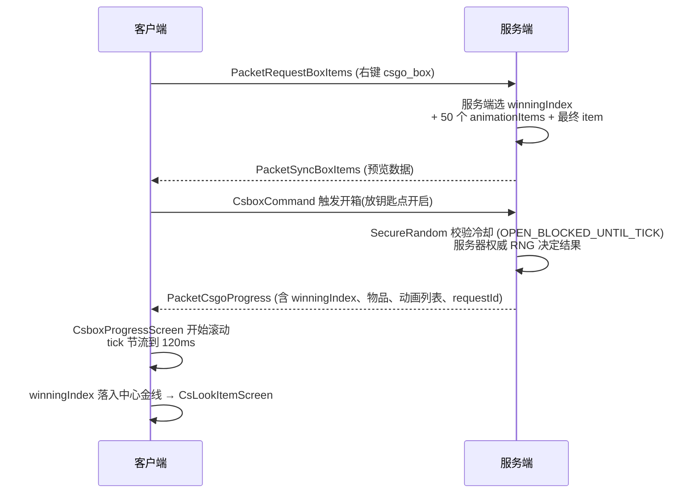

<!-- generated-by: gsd-doc-writer -->
# CS2-Box 架构

> 跨 v1_21_1 / v26_1_2 双平台的 CS:GO 风格开箱模组的模块拓扑、核心抽象、数据流与渲染管线。

## 1. 项目概览

CS2-Box 是用 Java 21 / 25 编写的 NeoForge 模组,把 CS:GO 的开箱机制复刻进 Minecraft。核心抽象都在 `common/` 中,两个平台模块(`v1_21_1/`、`v26_1_2/`)只承担入口注册、Screen 实现、网络接线、Attachment 注册等版本敏感工作。

**关键事实**:

- 模组 ID:`csgobox`,当前版本 `1.0.5`
- Java toolchain:`v1_21_1` 用 Java 21,`v26_1_2` 用 Java 25 + `--enable-preview`(NeoForm 重编译要求)
- 共享资源:`common/src/main/resources/` 由两个平台通过 `srcDir project(':common').file('src/main/resources')` 引入(v26_1_2 设置 `duplicatesStrategy = EXCLUDE`)
- 依赖方向约束:**`common/` 不得直接 `import net.minecraft.*` 或 `import net.neoforged.*`**(`grep "import net\.minecraft" common/src/main/java` 0 匹配确认)

## 2. 模块拓扑

```
+----------------------+        +----------------------+        +----------------------+
|      v1_21_1/        |        |      v26_1_2/        |        |        common/       |
|----------------------|        |----------------------|        |----------------------|
| @Mod 入口 (v1.21.1)  |        | @Mod 入口 (v26.1.2)  |        | platform/* 接口      |
| DeferredRegister     |        | DeferredRegister     |        | 共享业务逻辑          |
| AttachmentType       |  <-->  | AttachmentType       |  <-->  | BoxDefinition        |
| Screen 实现          |        | Screen (extractRender|        | BoxJsonLoader        |
| GuiGraphics 旧 API   |        | State API + PIP 3D) |        | RandomItem           |
| 网络接线             |        | 网络接线              |        | 数据包 Codec         |
| events 订阅          |        | events 订阅           |        | 共享资源(纹理/配方)  |
+----------------------+        +----------------------+        +----------------------+
         ↑                                ↑                                 ↑
         └───── shared: common/src/main/resources/ ←────────────────────────┘
```

依赖关系:`v1_21_1` → `common`;`v26_1_2` → `common`;`common` 不依赖任何平台模块。`active_versions` 决定单次构建哪个平台。

## 3. 核心抽象(common/)

### 3.1 箱子数据模型

- **`BoxDefinition`** — 不可变 Record,持有箱子 ID、name、所需钥匙 ID、5 档随机权重数组、物品分档清单
- **`BoxRegistry`** — 全局箱子注册表(按 ID 查 `BoxDefinition`)
- **`BoxJsonLoader`** — 加载 `config/csbox/*.json`,首次启动时若目录为空则写入默认 `weapon_supply_box.json`(含 `_tutorial` 字段,loader 忽略);在 `ServerStartingEvent` 触发 `loadAll()`
- **`GradeGroup` / `RandomItem`** — 5 档物品 + 加权随机选择(long 类型总权重避免溢出)
- **物品 schema**:`{ "id": "...", "count": 1, "components": {...} }`(1.21+ components),旧版 `tag` 字符串仍可加载

### 3.2 配置

- **`CsboxConfig`** — NeoForge `ModConfigSpec`,11 个配置项,4 个 TOML 分组(general / advanced / sound / animation)
- 注册为 `ModConfig.Type.COMMON`,TOML 路径 `config/csgobox.toml`
- `CONFIG` 是 `public static final`,在 `static {}` 块中通过 `ModConfigSpec.Builder().configure(CsboxConfig::new)` 初始化(不用 `init()`,那是一个 v1.0.5 修复的 bug)
- 监听 `ModConfigEvent.Reloading` 记录日志

### 3.3 物品

- **`ItemCsgoBox`** / **`ItemCsgoKey`** + `ModItems`(DeferredRegister 集中注册)
- 4 把钥匙:`csgo_key0`(铁)、`csgo_key1`(金)、`csgo_key2`(钻石)、`csgo_key3`(下界合金,仅锻造台配方)

### 3.4 平台接口

- `common/src/main/java/platform/` — 10 个接口,由 `Platform26.java` 等 platform 实现注入
- 解耦:平台代码不直接 new 业务对象,而是通过 `Platform26.boxRegistry()` 之类的接口方法取

## 4. 开箱数据流



## 5. GUI 渲染管线(双平台对比)

| 维度 | v1_21_1 (1.21.1) | v26_1_2 (26.1.2) |
|---|---|---|
| 入口方法 | `Screen.render(GuiGraphics,...)` | `Screen.extractRenderState(GuiGraphicsExtractor,...)` |
| 矩阵抽象 | `PoseStack` | `Matrix3x2f` instance API(`guiGraphics.pose()`) |
| 渲染管道 | 静态 `RenderSystem` 调用 | decoupled rendering 管线(`RenderPipelines.GUI_TEXTURED` 等) |
| 3D 物品预览 | `BakedModel` 渲染管线 | 自定义 `PictureInPictureRenderState` + `Icon3DRenderer`(走 PIP 3D 路径) |
| 2D 网格物品 | 直接 blit | `guiGraphics.item(...)` 2D 渲染(deferred item pipeline) |
| Blit 签名 | 9-arg overload | `guiGraphics.blit(RenderPipeline, Identifier,...)` 新签名 |
| 按钮色系 | 硬编码 `0xFF00AA00` / `0xFFFF0000` | `ButtonPalette.OPEN` / `ButtonPalette.DANGER` token(hover-aware) |
| 文本限宽 | 裸 `Font.width` | `RenderFontTool.drawStringClamped` + 省略号 |
| 渲染状态 | 单 stratum | `guiGraphics.nextStratum()` 分层(stratum 排序由 26.1.2 decoupled 引擎控制) |

### 5.1 v26_1_2 独有工具类

- **`gui/pip/Icon3DRenderer`** — `PictureInPictureRenderer<Icon3DRenderState>`,持有 full PoseStack(允许 3D 模型旋转)
- **`gui/pip/Icon3DRenderState`** — 携带 ItemStackRenderState、rotX/rotY/rotZ 度数
- **`utils/ButtonPalette`** — `OPEN` / `DANGER` 常量 + `drawButton(...)` + `isInside(...)` 统一按钮系统
- **`utils/RenderFontTool`** — `drawString(...)` + `drawStringClamped(...)`(二分截断 + `"…"` 后缀)
- **`platform/Platform26`** — v26_1_2 平台接口实现,注入到 `common/` 的 Platform 接口

## 6. 网络包

5 个自定义数据包,通过 NeoForge `CustomPacketPayload` 注册:

| 包 | 方向 | 内容 |
|---|---|---|
| `PacketCsgoProgress` | S → C | 开箱进度 + 服务端权威 RNG 结果(winningIndex、items、grades、requestId) |
| `PacketBoxOpenResult` | S → C | 最终开箱结果(用于 CsLookItemScreen) |
| `PacketSyncBoxItems` | S → C | 预览数据(右键箱子时拉取 50 个 item) |
| `PacketRequestBoxItems` | C → S | 客户端拉取预览请求 |
| `PacketValidation` | S → C | 客户端请求校验(防过期响应匹配) |

每个包都有 `Codec`(持久化)和 `StreamCodec`(网络流)。`PacketCsgoProgress` 内置 `SecureRandom` UUID→tick map 做开箱防双击冷却(`OPEN_BLOCKED_UNTIL_TICK`)。

## 7. 事件订阅

- **`ClickEvent`** — `@EventBusSubscriber(value = Dist.CLIENT, modid = CsgoBox.MODID)`,处理右键开箱、点击 Screen 按钮等
- **`ModEvents`** — `LivingDeathEvent`(生物掉落 csgo_box 投骰)、`ServerStartingEvent`(触发 BoxJsonLoader.loadAll)
- **成就触发器**:`OpenedBoxTrigger`(主动开箱 → A Fresh Start / Shopper 计数)、`ModLoadedTrigger`(模组加载时)

## 8. 成就系统

通过 Minecraft 原生 `CriteriaTriggers` 持久化,无需新增 Capability,存档迁移无影响:

- **`全新的开始`(A Fresh Start)** — 玩家首次主动右键开启 csgo_box 时解锁(Mob 掉落不算)
- **`导购`(Shopper)** — 隐藏紫色挑战,累计主动开 200 个 csgo_box 解锁;`hidden: true`,前置条件未达时不显示
- 数据走 `Stats.CUSTOM` 统计 `csgobox:opened_boxes`,关闭 `enableAchievements` 时仍累加(保留进度),重新开启后恢复触发
- 注册在 `csgobox:advancement/root.json` 节点下

## 9. 资源分层

```
common/src/main/resources/         ← 跨版本资源(纹理、音效、lang、配方、advancement)
  ├── assets/csgobox/textures/      (csgo_background.png 等)
  ├── assets/csgobox/sounds/
  ├── data/csgobox/recipe/          (csgo_key0/1/2 + csgo_key3_smithing.json — 注意单数 recipe)
  └── data/csgobox/advancement/

v26_1_2/src/main/resources/         ← 平台特化资源(独立运行时类路径)
  └── assets/csgobox/items/         (csgo_box / csgo_key0-3 items)

runs/client/                        ← 运行时测试数据(csgobox.toml、csbox/*.json)
runs/server/
```

## 10. 依赖方向约束

来源:`multiloader-execution-spec.md` §1.2 + `multiloader-refactor-plan.md`:

- **`common/` 不允许** `import net.minecraft.*` 或 `import net.neoforged.*`
- 所有版本敏感代码(GUI 渲染、Attachment 注册、网络上下文、注册表访问)留在平台模块
- 平台模块不重复实现 common 业务逻辑

## 11. 版本矩阵

| 组件 | v1_21_1 | v26_1_2 |
|---|---|---|
| Minecraft | 1.21.1 | 26.1.2 |
| NeoForge | 21.1.115 | 26.1.2.76 |
| NeoGradle | 7.0.171 | 7.1.38 |
| Gradle | 8.11 | 8.14 |
| Java toolchain | 21 | 25 `--enable-preview` |
| mod_version | `1.0.5` | `1.0.5-26.1.2`(后缀区分) |
| pack_format | 34 | 80 |
| 包名 | `com.reclizer.csgobox.v1_21_1.*` | `com.reclizer.csgobox.v26_1_2.*` |