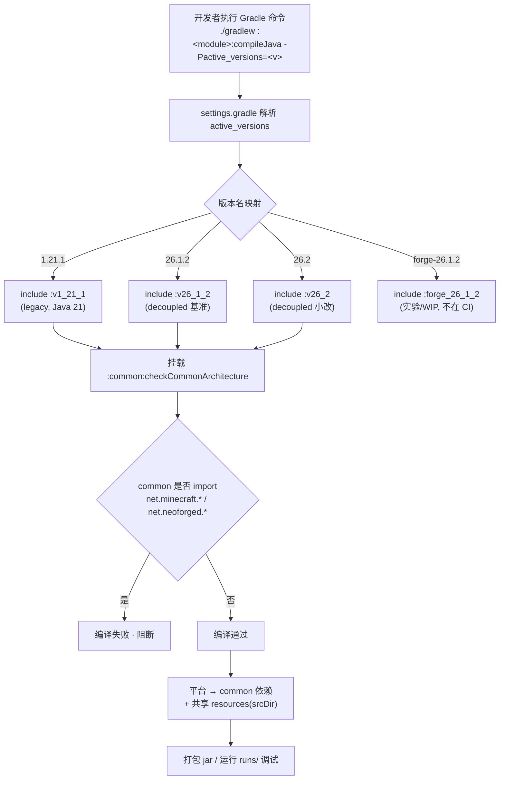
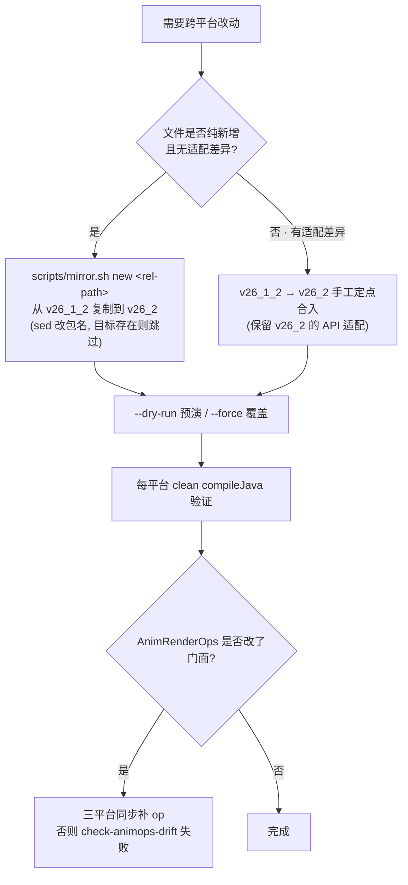
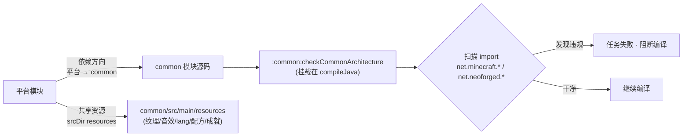
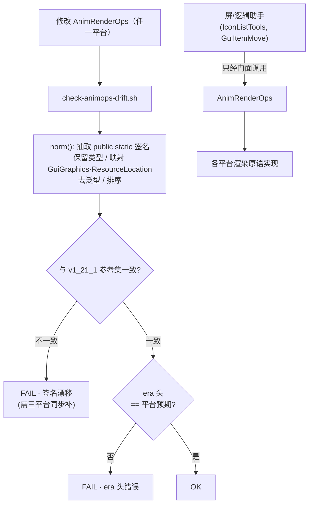
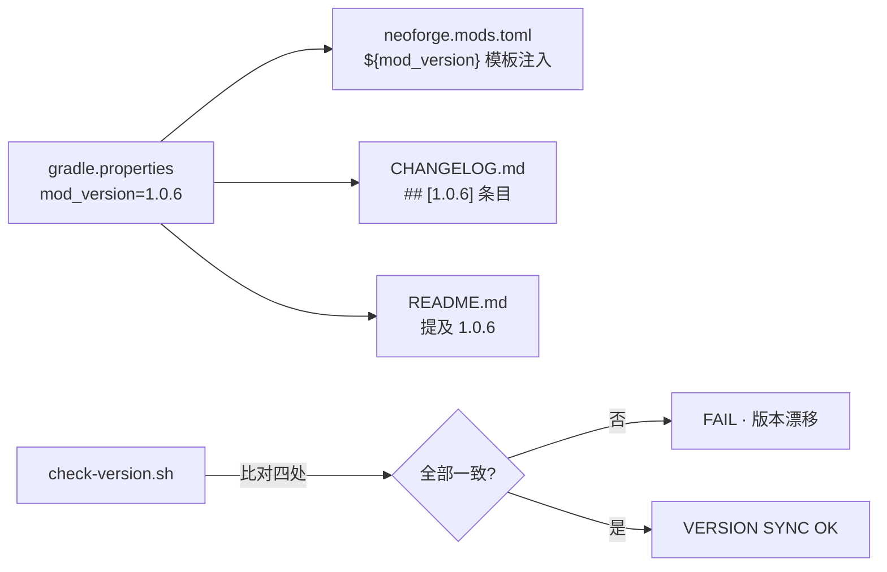
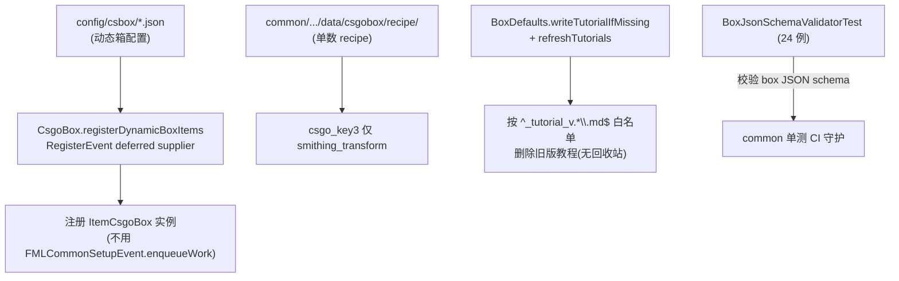
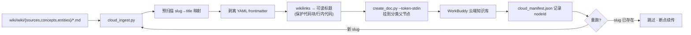
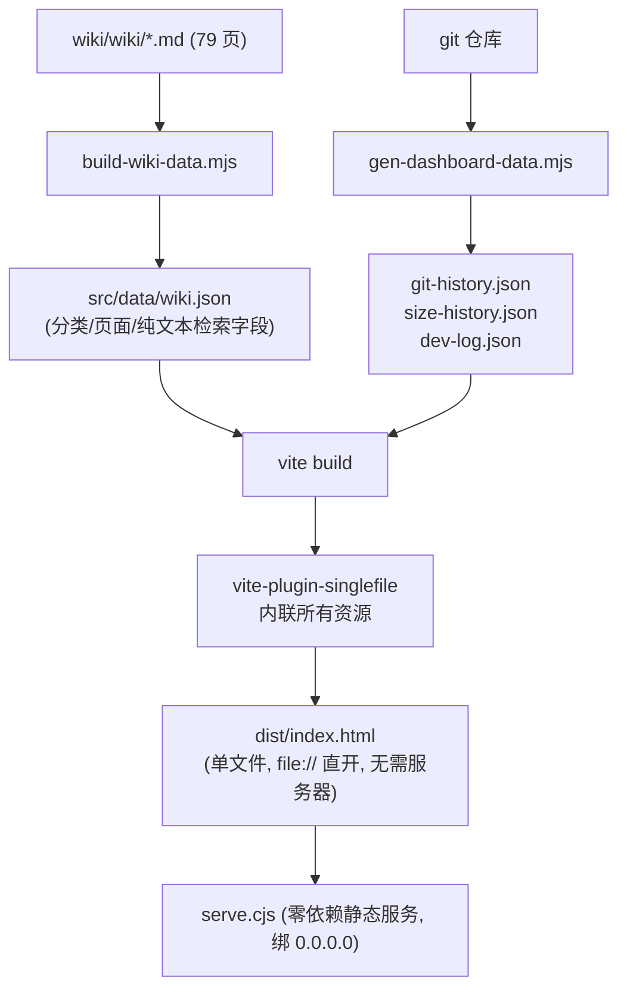
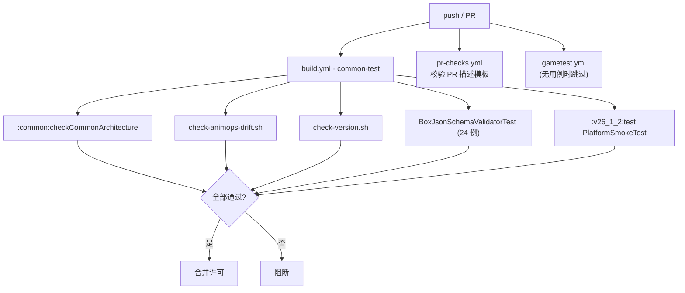

> ⚠️ 已归档（历史快照）：本文档记录技术栈全景分析的当时状态，不再随项目更新；当前信息以 README.md 与 docs/ 为准。

# CS2-Box 技术栈全景分析

> 一份面向维护者与新接手开发者的技术栈地图。配套流程图覆盖构建、架构、渲染、网络、数据、知识库与前端全部环节。
> 本文基于 `v26_1_2`（decoupled 基准）源码与各守护脚本整理；`v1_21_1` / `v26_2` 同构，仅渲染与事件 API 适配层有差异。实验模块 `forge_26_1_2` 与已归档 legacy 平台（tag `eol-legacy-21x-1.0.6`）不在范围内。

---

## 0. 先看两张已有的全景图

这两张图已经把「架构」和「核心开箱逻辑」画得很清楚，后续章节只补它们未覆盖的技术栈：

- **架构总览**（平台模块 / common / AnimRenderOps 门面 / 约束守护 / 版本同步 / 镜像纪律）：`docs/diagrams/cs2box_arch_cn.html`（源文件 `cs2box_arch.cw`）
- **开箱服务端权威流程图**（单次 / 批量 / 事件成就 / 动态箱 / 权威性约束）：`docs/diagrams/cs2box_openflow.html`

下面所有新增流程图用 Mermaid 表达，可在 GitHub、VS Code 预览插件或任何 Mermaid 渲染器里直接看。

---

## 1. 技术栈清单

| 维度 | 技术 / 工具 | 位置 | 备注 |
|---|---|---|---|
| 构建 | Gradle wrapper 9.5.1 + NeoGradle 7.1.38 | `settings.gradle` / `gradle.properties` | 每次调用只编一个 MC 版本 |
| 语言 | Java 21（`v1_21_1`）/ Java 25 + `--enable-preview`（`v26_*`） | 各 `build.gradle` toolchain | |
| 平台框架 | NeoForge 21.x / 26.x（decoupled） | `v1_21_1` / `v26_1_2` / `v26_2` | 实验：Forge 26.1.2（`forge_26_1_2`，未提交） |
| 共享层 | `common` 模块（代码 + 资源） | `common/` | 严禁 import MC/NeoForge |
| 渲染门面 | `AnimRenderOps`（13 个公开 op） | 各平台 `utils/AnimRenderOps.java` | 跨平台签名一致由脚本守护 |
| 网络 | Serverbound/Clientbound CustomPayload | `packet/PacketCsgoProgress*` | 服务端权威 RNG |
| 配置 | NeoForge `ModConfigSpec` | `CsboxConfig.java` | `bulkOpenCount` 服务端强制 |
| 数据校验 | JUnit 5（`BoxJsonSchemaValidatorTest`，24 例） | `common` 测试 | |
| 配方 | `data/csgobox/recipe/`（单数） | `common/src/main/resources/` | `csgo_key3` 仅锻造台 |
| 知识库 | 本地 Markdown + frontmatter + `[[wikilinks]]` | `wiki/wiki/` | 4 类页面 |
| 云端摄取 | `cloud_ingest.py` → WorkBuddy 资料库 | `wiki/output/scripts/` | 断点续传 |
| 前端 | Vite 5 + React 18 + Tailwind v4 + react-markdown | `wiki/wiki-site/` | singlefile 构建，`file://` 直开 |
| CI | GitHub Actions（`build.yml` / `pr-checks.yml` / `gametest.yml`） | `.github/workflows/` | 三道质量门 |

---

## 2. 构建系统与多平台选择

每次 Gradle 调用只允许激活一个 Minecraft 版本——NeoGradle 的 userdev 会在根项目注册同一个 IDEA 扩展，多版本并行会冲突。激活哪个版本由 `-Pactive_versions=<v>` 决定，缺省 `26.1.2`（写在 `gradle.properties`）。

要点：
- `v1_21_1` / `forge_1_20_1` 有 `compileOnly` TACZ 依赖（永恒枪械工坊），首次构建前分别跑 `scripts/download-tacz.sh` / `scripts/download-tacz-1201.sh` 填充 `local-repo/com/tacz/` 并从 jar 提取 `simplebedrockmodel`；运行期经 `ModList.isLoaded("tacz")` 检测，无 TACZ 静默降级。
- `forge_26_1_2` 用 ForgeGradle 7（`net.minecraftforge.gradle.merge-source-sets=true`），源码未提交、不参与 CI 与镜像纪律。
- 涉及改动平台时务必 `clean` 编译——增量缓存可能掩盖破坏（AGENTS.md 明确提醒）。

---

## 3. 平台镜像纪律

三个平台模块不是纯拷贝：`v26_2` 有 decoupled API 适配（`BuiltInRegistries.ITEM.get()` 返回 Optional、`spawnAtLocation`、`lookup()`、`MouseButtonEvent`、`setScreenAndShow`、PIP 渲染器等）。正确的跨平台改动顺序是：先在基准模块改，再定点合入。

红线：**禁止用 `v26_1_2` 整文件覆盖 `v26_2`**——会破坏适配（历史教训：曾导致某 legacy 平台编译失败）。`mirror.sh` 默认对「目标已存在」的文件跳过并告警，正是这道保险。

---

## 4. 架构约束 CONSTRAINT-001

`common/` 不得 import 任何 `net.minecraft.*` / `net.neoforged.*`，因为编译环境没有 MC classpath，违反即编译失败。这条约束由 `:common:checkCommonArchitecture` 任务自动挂载在 `compileJava` 上（任意编译 / 测试都会触发，含 `forge_26_1_2` 把 common 源码编进自身 classpath 的场景）。

依赖方向严格单向：`平台 → common`，`common` 不依赖任何平台。

---

## 5. AnimRenderOps 渲染门面与跨平台一致性

`utils/AnimRenderOps.java` 是动画渲染的**唯一适配点**。各平台一份，头部用 `// era: legacy|decoupled` 标注。屏与逻辑助手只经它调用渲染原语，共 13 个公开 op：

`blitTextured`×3、`fill`、`fillGradient`、`scissor`、`scissorDisable`、`setBlendNormal`、`flush`、`renderBlurredBackground`、`renderItem2D`、`renderItem3D`、`supports3D`。

跨平台签名一致性由 `scripts/check-animops-drift.sh` 守护（CI `common-test` 已接线）：把每个平台的公开方法签名归一化（保留类型、映射 GUI 类型族、去泛型、排序），与 `v1_21_1` 参考集比对，并要求 era 头正确。

调用方：`IconListTools`（2D 物品网格，26.x/1.21.8+ 有 per-item bounding box 居中）、`GuiItemMove`（3D 拖拽预览，纯数学保留，渲染委托 `renderItem3D`）。

---

## 6. 版本号四同步

升级时四处必须同步：`gradle.properties` 的 `mod_version` + `neoforge.mods.toml`（`${mod_version}` 模板变量自动注入）+ `CHANGELOG.md` + `README.md`。一致性由 `scripts/check-version.sh` 检查（`common-test` job 已接入）。

注意：`mods.toml` 里必须保留 `${mod_version}` 模板变量，手写版本字符串会随时间失同步。

---

## 7. 服务端权威开箱

完整流程已画在 `docs/diagrams/cs2box_openflow.html`，这里只列关键事实，便于和其余技术栈串起来：

- 两条入口（单次 `PacketCsgoProgress` / 批量 `PacketCsgoBulkProgress`）共用同一套权威抽奖与发放逻辑。
- 中奖结果 + 磨损值（wear）完全由服务端 `SecureRandom` 决定；客户端 `requestId` 只用于动画匹配，**不参与授权**。
- 防作弊上限 `CONFIG.bulkOpenCount()`（0=无限）服务端强制；冷却 `OPEN_BLOCKED_UNTIL_TICK`（10 tick）+ `tickOpenBlockMap` 定期清理。
- 批量开箱用 `BULK_COMPUTE_POOL` 异步计算，主线程 `finalizeBulkOpen` 做消耗与发放；提交到消耗间抛异常 → 玩家零损失，密钥不足仅回退箱子。
- 下游触发（单次/批量共用）：`awardStat(OPENED_BOXES_STAT)` → `OpenedBoxTrigger`（受 `enableAchievements` 开关）→ `NeoForge.EVENT_BUS.post(BoxOpenedEvent)`（KubeJS 兼容，不可取消）。

---

## 8. 数据 / 内容管线

要点：动态箱在注册阶段即生成 `ItemCsgoBox`，故开箱流程无需区分「硬编码」与「配置驱动」来源；registry 已 freeze，不能在 `FMLCommonSetupEvent.enqueueWork` 里注册。

补充两点（经源码复核）：
- **配方目录只有钥匙与军械配方，没有箱子配方。** `common/src/main/resources/data/csgobox/recipe/` 现有 6 个文件（`csgo_key0/1/2`、`csgo_key3_smithing`、`armory_point_exchange`、`armory_recycler`），`csgo_key3` 走 `smithing_transform`（锻造台）。箱子本身是 `config/csbox/*.json` 经 `RegisterEvent` 动态注册的 item，不依赖 recipe。
- 脚本名校准：`port-armory-point.py`（定点合入 `armory_point` 到 `v26_2`）+ `port-forge-2612.py`（NeoForge→Forge 机械转换），没有 `port-12111.py`。

---

## 9. 知识库：本地 wiki + 云端摄取

本地知识库 `wiki/wiki/` 分 4 类页面（`sources` / `concepts` / `entities` / `comparisons`），带 frontmatter 与 `[[wikilinks]]`；一致性由 `wiki/output/scripts/wiki_lint.py` 检查。

云端摄取脚本 `wiki/output/scripts/cloud_ingest.py` 把本地 wiki 推到 WorkBuddy 资料库，支持断点续传：

`readme.md` 作为本地索引页，云端由分类索引替代，不会被摄取。`KB_TOKEN` 经 stdin 传入，不落盘。

---

## 10. 知识库前端 wiki-site

`wiki/wiki-site/` 是一个零后端、可离线打开的知识库网站。数据由构建脚本从 `wiki/*.md` 生成，详见《对接网页开发师文档》。构建与数据管线：

前端栈：React 18 + react-router-dom（HashRouter）+ react-markdown（remark-gfm / rehype-slug / rehype-highlight）+ Tailwind v4（`@theme` 自定义 token：`--bg`/`--text`/`--accent` 等）+ lucide-react 图标。路由为 `/page/:slug` + `/dashboard`。

---

## 11. CI/CD 质量门

`.github/workflows` 三道门：

`docs/CI-PROTECTION.md` 另有分支保护设置；代码审查清单见 `docs/CODE-REVIEW.md`（CONSTRAINT-001 / 镜像纪律 / 版本四同步 / AnimRenderOps 漂移 / 并发权威）。

---

## 12. 技术栈依赖关系一句话总结

`平台模块` 依赖 `common`（单向），`common` 被架构约束锁死不能碰 MC API；渲染经 `AnimRenderOps` 门面隔离平台差异；开箱逻辑全在服务端权威；内容/数据走 JSON schema 校验与动态注册；知识资产本地用 wiki Markdown 维护、云端用 `cloud_ingest` 摄取、网页用 `wiki-site` 单文件构建呈现；所有跨平台一致性（架构、动画门面、版本号）都由 `scripts/` 里的守护脚本在 CI 兜底。

下一步建议：把第 2–6、9–11 节的 Mermaid 也渲染成离线 HTML（沿用 `cs2box_openflow.html` 的样式），与现有两张图放进同一个 diagrams 目录，形成完整的可视化套件。
